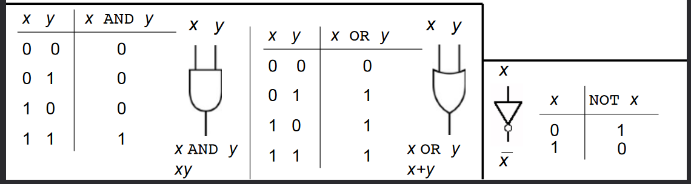
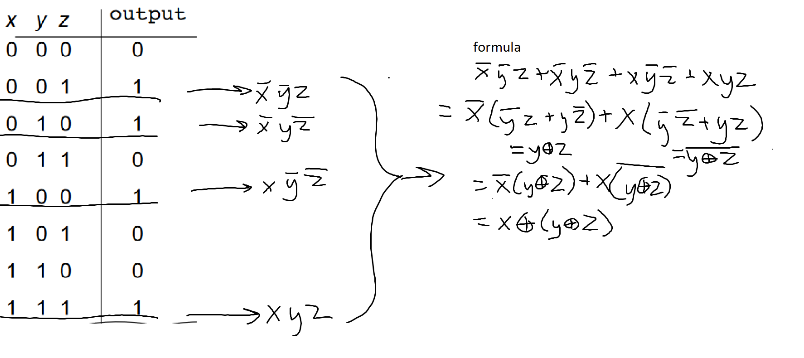
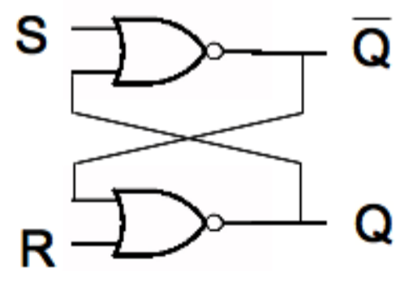

# Bitwise Operations
## Shifting
- helps with space and time efficiency
- more common in C languages
### Left Shifting
we have (42)10 and want to shift it one place *left*
```
 042
<<<
042_

0420
```
multiply by ten and fill remaining digit with 0. this returns 420

now we want to left-shift (0011)2:
```
 011        = (3)10
 <<<
011_ 
0110        = (6)10
```
multiply by 2 and fill remaining digit with 0


### Right Shifting
we have (42)10 and want to shift it one place *left*
```
042
>>>
_04
004
```
integer divide by ten and fill remaining digit with 0. this returns 4

now we want to right-shift 0101:
```
0101        = (5)10
 >>>
_010
0010        = (2)10
```
integer divide by 10 and fill vacant place with 0.


## Addition
```
10^2_10^1_10^0_
        4    3
+       8    9
=            ?

  (1)  (1)
10^2_10^1_10^0_
        4    3
+       8    9
=  1    3    2

```

```
2^3_2^2_2^1_2^0_
      1   0   1
+     0   1   1
= 1   0   0   0
```
```
2^3_2^2_2^1_2^0_
  0   1   1   1
+ 0   1   1   0
= 1   1   0   1
```
## Multiplication
```
10^5    10^4    10^3    10^2    10^1    10^0
                        3       4       1
*                       1       0       2

=                       6       8       2

                0       0       0
+       3       4       1

=       3       4       7       8       2
```
```
2^5     2^4     2^3    2^2     2^1     2^0
                       1      1       1
*                      1      0       1

=                      1      1       1
                0      0      0
+       1       1      1
= 1     0       0      0      1       1
```


```
2^5     2^4     2^3    2^2    2^1     2^0
                       1      0       1
*                      1      1       0

=                      0      0       0
                1      0      1
+       1       0      1
=       1       1      1      1       0
```

## Russian Peasant Multiplication
- integer divide the first number by 2 until you get to 1 (include the row with 1)
- multiply the second number by 2 the same amount of times
- add together every right value for which the left value is odd    
- sometimes useful to save space while calculating
```
//2      *2
[21  *   6]
 10      12
[5       24] 
 2       48 
[1       96]

6 + 24 + 96 = 126
```
in base 2:
- \>\> = shift right = //2
- \>\> = shift left = *2
```
>>           <<
[10101   *       110]
  1010          1100
[  101         11000]
    10        110000
[    1       1100000]

110 + 11000 + 1100000 = 1111110
```

back in base 10
```
//2     *2
[33  *   7]
 16     14
  8     28
  4     56
  2    112
[ 1    224]

224 + 7 + 231
```
you could also do this one with the numbers switched for quicker/less computation

having the smaller number in the division column means less steps bc you will reach one quicker

# Representing Negatives in Binary
## Two's Compliment
- easiest way is to just designate the left-most bit to represent the sign.
  - e.g. `0101` = 5 and `1101` = -5
- in this case, though, what do we do with `1000`? is this now "negative" 0? and it's not equal to "positive" 0?
- plus, addition by negative numbers no longer functions the same as subtraction, even though it should
```
   0101                5
+  1101     ==>    + (-5)
= 10010            =   2  ???
  ^ overflow
```
## One's Compliment
- the leftmost bit is still the sign, but now to find the numeric value you have to invert all the bits
- e.g. 
  - `0111` = 7 and `1000` = -7
  - `0011` = 3 and `1100` = -3
- but... we still have positive and negative zeros
  - `0000` = 0, `1111` = -0
- better, but math still doesn't work. everything is 1 less than it should be.
  - pretty easy fix, just add 1 to whatever your solution is.
```
   0101                   5
+  1010         ==>   + (-5)
= 11111               =  -0
  ^ overflow
```
```
   0101                   5
+  1100         ==>   + (-3)
= 10001               =   1
  ^ overflow
```
## Correctly Converting/Representing Negatives
convert -6 to binary as a usable two's compliment number; i.e. (-6)10 = (?)2
```
find positive 6 in binary first:
_ _ _ _  ->  0 1 1 0  =  (6)10
8 4 2 1      8 4 2 1

convert to one's complement:
the original number is negative, so negate all of the bits
0110 -> 1001
the leftmost bit will now be the NEGATIVE 8s place

add 1 to make math work:
1001 + 0001 = 1010

this should be our final answer. check:
 1 0 1 0  -> base 10: -8+0+2+0 = -6 
-8 4 2 1
```
our final answer is (1010)2. this is now usable in math as -6.

now find -30 in binary with 6 bits:
```
convert absolute value to binary:
(30)10 = (011110)2

convert to one's compliment (negate all bits)
011110 --> 100001

add 1:
100001 + 000001 = 100010

check:
   1  0 0 0 1 0 --> base 10: -32+2 = -30
 -32 16 8 4 2 1
```

-11 in 8 bits:
```
(-11)10 = (00001011)2
negate 00001011 = 11110100
11110100 + 00000001 = 11110101

check:
   1  1  1  1 0 1 0 1 --> base 10: -128+64+32+16+0+4+0+1 = -11
-128 64 32 16 8 4 2 1
```

negative 1 in any amount of bits is all 1s, assuming 2's compliment.
- `(111)2` = -1
- `(1111111)2` = -1
- `(11111111)2` = -1

the largest possible number in 2's compliment if we were using 9 bits is 255.
- if we were ignoring the sign bit at the front it would be more.
- however, because we are only using the 8 unsigned bits, 255 is the largest it can hold.

the smallest negative number it can hold is -256

# Computing Digitally
everything you do on a cpu gets converted to binary and has some operation done to it. all of these operations can be described in words, a table, an expression, and a circuit.

## Logic Practice
N.B.

key:
- everything can be written with AND, OR, and/or NOT, it just might be impractical
- addition = OR
  - `x + y` = `x OR y`
- multiplication = AND
  - `xy` = `x AND y`
  - `xy(x + y)` = `(x AND y) AND (x OR y)`
- `x̄` = `NOT x` = `!x` = `x'`
  - x̄ seems to be the preferred symbol here
- `x ↓ y` = `x NOR y`
- `x ⊕ y` = `x XOR y`
  - see below

e.g., xor:
- a function of two binary variables. the output is 1 *iff* exactly one of the inputs is 1.

  |x |y |xor(x,y)|
  |--|--|------|
  |0 |0 |0|
  |0 |1 |1|
  |1 |0 |1|
  |1 |1 |0|

- formula: `x̄y + xȳ`
- shorthand is ⊕:
  - `x ⊕ y` = `x̄y + xȳ`

NOR gate:
|x |y |nor(x,y)|
|--|--|--------|
|0 |0 |1       |
|0 |1 |0       |
|1 |0 |0       |
|1 |1 |0       |

## Odd Parity Circuit
let's try making an odd parity circuit: a function with ***3*** inputs where the output is 1 *iff* the amount of 1s is odd.

we'll use the minterm expansion principle (i.e. pull out all the conditions that return 1, OR them, then reduce):


## Binary Adder
1. take the carry-in (if this is the first bit, it will be 0)
2. perform addition
3. carry out a 1 if necessary, otherwise carry out a 0
4. restart

|x|y|carry-in|sum|carry-out|
|-|-|--------|---|---------|
|0|0|0       |0  |0        |
|0|0|1       |1  |0        |
|0|1|0       |1  |0        |
|0|1|1       |0  |1        |
|1|0|0       |1  |0        |
|1|0|1       |0  |1        |
|1|1|0       |0  |1        |
|1|1|1       |1  |1        |

we can find just the sum using the parity circuit. here's how you find the carry-out: `Cout = xy + Cin(x⊕y)`

## De Morgan's Laws
-  NOT(xy) = x̄ + ȳ
-  x̄ + ȳ = NOT(xy)

you can prove this somehow but who cares

# History of Computing
- starting from the creation of actual computers
- started with electric logic gates
- used to run off small relays
  - a stray moth flying into a relay and breaking it created the term computer bug
- then vacuum tubes
  - whole system weighed 30 tons
  - had to be replaced often
- integrated circuits
  - this is what we use now
  - hard to make

## People
- Alan Turing
  - father of computer science
  - code breaker in WWII
    - created Enigma
- Joan Clarke
  - also did a lot
  - less popular because women were ignored

# One-bit Memory
## SR or RS latch

- this symbol is a NOR gate. it look like an OR gate with the NOT circle after it
- maybe we want to store 1.
  - set S (set bit) to 1 and R (reset bit) to 0
  - Q will equal 1 and be stored, !Q will be reset to 0
  - Q and !Q will always be opposite
## D-Latch
- stops user from pressing both S and R at once
## RAM
- two address bits + 3 data bits + write/read
- 10 110 0 = at the 10th position, write 110
- sends the strobe electricity iff the address is correct
  - strobe takes an AND of the read/write bit and D
  - sends electricity to the D-latch to write at that address
  - works because only one address will be written to because the strobe must be on AND it must be trying to write to the address
- 